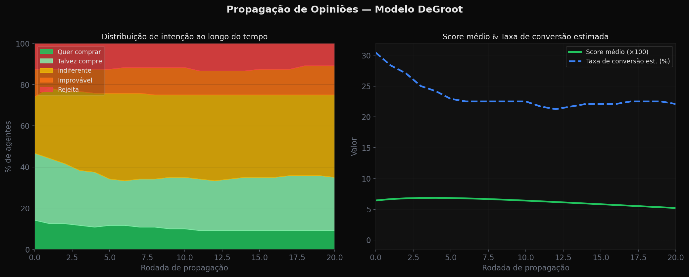
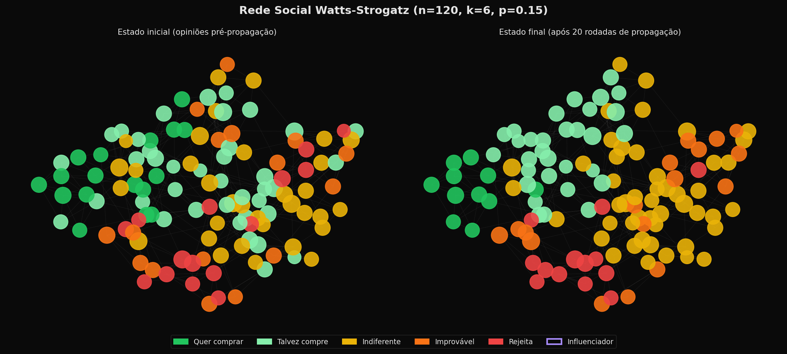
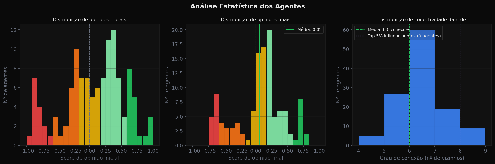
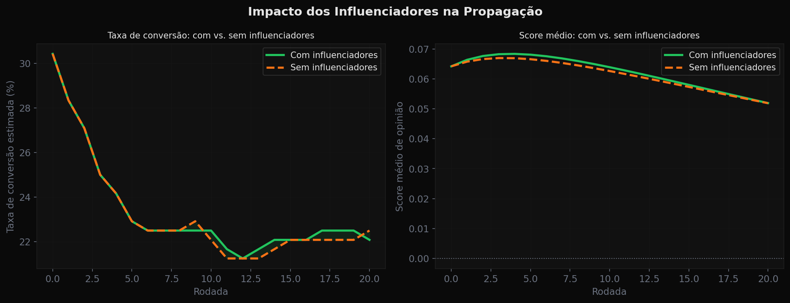
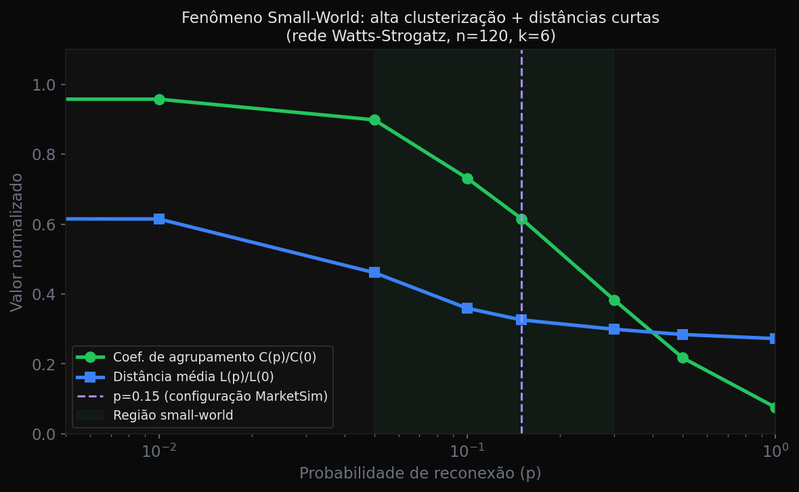

<div align="center">

# MarketSim — Simulador de Mercado com IA

**Valide produtos antes de lançar. Entenda como seu mercado vai reagir.**

[](https://python.org)
[](https://fastapi.tiangolo.com)
[](https://react.dev)
[](https://typescriptlang.org)
[](https://groq.com)
[](LICENSE)

</div>

---

## O que é?

MarketSim é uma plataforma que usa **IA generativa + simulação de redes sociais** para prever como um público-alvo vai reagir a um produto antes do lançamento.

Em vez de pesquisas de mercado caras e lentas, o sistema:

1. **Gera centenas de personas realistas** com perfis psicográficos únicos (LLaMA 3.3 70B via Groq)
2. **Avalia a reação de cada persona** ao produto com base em seus valores, dores e contexto
3. **Constrói uma rede social** com topologia small-world (Watts-Strogatz) onde as opiniões se propagam
4. **Simula o boca-a-boca** usando o algoritmo de consenso DeGroot
5. **Gera um relatório estratégico** com segmentos, objeções e recomendações

---

## Demo

### Evolução das opiniões ao longo das rodadas de propagação



### Rede social antes e depois da propagação



### Distribuição de opiniões e conectividade dos agentes



### Impacto dos influenciadores na taxa de conversão



### Validação da topologia Small-World (Watts-Strogatz)



> **Screenshots da interface:** adicione prints do sistema rodando para mostrar o visual em tempo real.

---

## Como funciona

### Arquitetura do Modelo

```
┌─────────────────────────────────────────────────────────────────┐
│                        MARKETSIM PIPELINE                        │
└─────────────────────────────────────────────────────────────────┘

  [Usuário define] ──► Audiência + Produto
         │
         ▼
┌─────────────────┐    LLaMA 3.3 70B     ┌──────────────────────┐
│  FASE 1: GERAÇÃO │ ──────────────────► │  N personas únicas    │
│  de personas     │   (Groq API, async, │  (nome, idade, cidade,│
│  em lotes        │    5 concurrent)    │   valores, dores...)  │
└─────────────────┘                      └──────────────────────┘
         │
         ▼
┌─────────────────┐    LLaMA 3.3 70B     ┌──────────────────────┐
│  FASE 2: OPINIÃO │ ──────────────────► │  Score por persona    │
│  inicial         │   (8 concurrent)    │  -1.0 a +1.0         │
│                  │                     │  + reasoning          │
└─────────────────┘                      └──────────────────────┘
         │
         ▼
┌─────────────────┐                      ┌──────────────────────┐
│  FASE 2: GRAFO  │ ──────────────────► │  Watts-Strogatz       │
│  small-world    │   networkx           │  k=6, p=0.15         │
│                 │                     │  + centralidade        │
└─────────────────┘                      └──────────────────────┘
         │
         ▼
┌─────────────────┐    DeGroot Model     ┌──────────────────────┐
│  FASE 3:        │ ──────────────────► │  Opiniões convergindo │
│  PROPAGAÇÃO     │   20 ticks,         │  em tempo real        │
│  de opiniões    │   WebSocket         │  via WebSocket        │
└─────────────────┘                      └──────────────────────┘
         │
         ▼
┌─────────────────┐    LLaMA 3.3 70B     ┌──────────────────────┐
│  FASE 4:        │ ──────────────────► │  Relatório completo   │
│  RELATÓRIO      │                     │  + segmentos          │
│  estratégico    │                     │  + objeções           │
└─────────────────┘                      └──────────────────────┘
```

### Algoritmo de Propagação (DeGroot)

O modelo de influência social é baseado no **algoritmo de consenso DeGroot**, com extensões:

```
score_novo(i) = score_atual(i) × (1 - social_weight)
              + média_ponderada_vizinhos × social_weight

onde:
  social_weight = (1 - confiança_agente) × SOCIAL_PRESSURE_WEIGHT
  
  # Influenciadores resistem 3x mais à mudança
  if agente.is_influencer:
      social_weight × 0.3

  # Peso de vizinhos proporcional à sua influência (centralidade)
  w_vizinho = 0.5 + influence_score × 1.5
```

**Propriedades emergentes simuladas:**
- Formadores de opinião travam tendências do mercado
- Câmaras de eco surgem naturalmente em comunidades densas
- Opiniões extremas (forte compra/rejeição) tendem a polarizar grupos

### Rede Social (Watts-Strogatz)

```
Parâmetros padrão:
  k = 6  (cada pessoa conhece ~6 pessoas diretamente)
  p = 0.15 (15% de chance de reconexão aleatória)

Resultado: rede com coeficiente de agrupamento alto
           + distância média baixa ("mundo pequeno")
           = similar a redes sociais reais (Facebook, LinkedIn)
```

---

## Stack Técnica

### Backend
| Tecnologia | Uso |
|---|---|
| **FastAPI** | API REST + WebSocket para updates em tempo real |
| **Groq API** | LLaMA 3.3 70B para geração de personas e relatórios |
| **NetworkX** | Construção e análise da rede social Watts-Strogatz |
| **NumPy** | Cálculos do modelo DeGroot |
| **Pydantic v2** | Validação de dados e modelos |
| **asyncio** | Geração concorrente de personas (5-8 requests paralelos) |

### Frontend
| Tecnologia | Uso |
|---|---|
| **React 19** | UI reativa |
| **TypeScript** (strict) | Tipagem completa |
| **Sigma.js v3** | Renderização do grafo de rede social |
| **Graphology** | Estrutura de dados do grafo |
| **Zustand** | Gerenciamento de estado global |
| **Framer Motion** | Animações e transições |
| **React Router v7** | Navegação entre páginas |

---

## Instalação

### Pré-requisitos
- Python 3.11+
- Node.js 18+
- Chave de API Groq gratuita: [console.groq.com](https://console.groq.com)

### Backend

```bash
cd market-sim/backend

# Configurar variáveis de ambiente
cp .env.example .env
# Editar .env e adicionar: GROQ_API_KEY=sua_chave_aqui

# Instalar dependências
pip install -r requirements.txt

# Rodar
python -m uvicorn main:app --reload --host 0.0.0.0 --port 8000
```

### Frontend

```bash
cd market-sim/frontend

npm install
npm run dev
# Acesse: http://localhost:5173
```

---

## Variáveis de Configuração

| Variável | Padrão | Descrição |
|---|---|---|
| `GROQ_API_KEY` | — | **Obrigatória.** Chave da API Groq |
| `GROQ_MODEL` | `llama-3.3-70b-versatile` | Modelo LLM |
| `AGENT_COUNT` | `200` | Número de personas geradas |
| `PROPAGATION_TICKS` | `20` | Rodadas de propagação de opinião |
| `TICK_DELAY_MS` | `600` | Delay entre rodadas (ms) |
| `SOCIAL_PRESSURE_WEIGHT` | `0.35` | Intensidade da influência social |
| `INFLUENCER_TOP_PCT` | `0.05` | % de agentes considerados influenciadores |
| `GRAPH_K_NEIGHBORS` | `6` | Conectividade da rede (Watts-Strogatz k) |
| `GRAPH_REWIRE_PROB` | `0.15` | Probabilidade de reconexão aleatória |

---

## Estrutura do Projeto

```
market-sim/
├── backend/
│   ├── api/routes.py          # Endpoints REST + WebSocket
│   ├── core/
│   │   ├── agent_factory.py   # Geração de personas com LLM
│   │   ├── graph_builder.py   # Rede Watts-Strogatz
│   │   ├── opinion_model.py   # Algoritmo DeGroot
│   │   ├── simulation_engine.py  # Orquestrador das fases
│   │   └── report_generator.py   # Relatório com LLM
│   ├── llm/
│   │   ├── groq_client.py     # Cliente async com retry
│   │   └── prompts.py         # Templates de prompts
│   ├── models/                # Schemas Pydantic
│   ├── storage/store.py       # Persistência em JSON
│   └── main.py
│
└── frontend/
    ├── src/
    │   ├── components/graph/  # Visualização Sigma.js
    │   ├── components/panels/ # MetricsBar, LiveFeed, AgentDetail
    │   ├── pages/             # Home, NewSimulation, SimulationView, Report
    │   ├── store/             # Zustand global state
    │   ├── hooks/             # useSimulation (WebSocket)
    │   └── api/client.ts      # HTTP + WebSocket client
    └── ...
```

---

## Limitações e Trabalhos Futuros

- [ ] Persistência em banco de dados (PostgreSQL)
- [ ] Autenticação e isolamento multi-usuário
- [ ] Análise de sensibilidade de preço automatizada
- [ ] Exportação de relatório em PDF
- [ ] Comparação entre múltiplas simulações
- [ ] Suporte a redes de influência assimétricas

---

## Autor

**Mateus** · [@icbmmateus16](https://github.com/icbmmateus16)

---

<div align="center">
  <sub>Construído com FastAPI, React e LLaMA 3.3 70B</sub>
</div>
