<div align="center">

# MarketSim B2B Engine

### Predictive Sandbox for Go-To-Market Validation

*Simulate market adoption across hundreds of autonomous AI agents — before spending a single dollar on real GTM.*

<br/>

<div>
  
  
  
</div>

<br/>

<div>

[](#)
[](#)
[](#)
[](#)
[](#)
[](#)
[](#)

</div>

[English](./README-EN.md) | [Documentação em Português](./README.md)

</div>

---

**MarketSim** generates a digital market — hundreds of psychometric personas connected in a Watts-Strogatz small-world graph — and runs Bayesian opinion propagation through the network over configurable simulation ticks. Each agent has demographic traits, risk tolerance, price sensitivity, and a Bayesian confidence prior. Similar agents influence each other more (homophily). Confidence decays over time, making the market progressively susceptible to social pressure.

You give it a product description, a ticket price, and a target audience. It returns an interactive adoption funnel, a relational graph that updates in real time, and a 2-pass AI report that critiques its own first draft before delivering the final analysis.

> No surveys. No focus groups. No burn of real budget.
> A deterministic, reproducible sandbox that runs in minutes.

---

## Interface — Dark Console Dashboard

<div align="center">
<table>
<tr>
<td width="50%">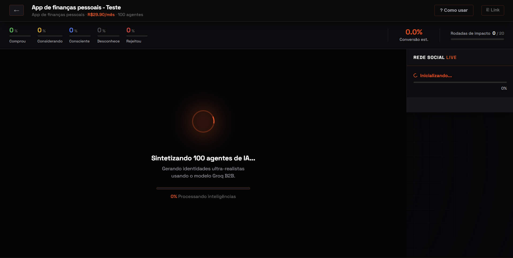</td>
<td width="50%">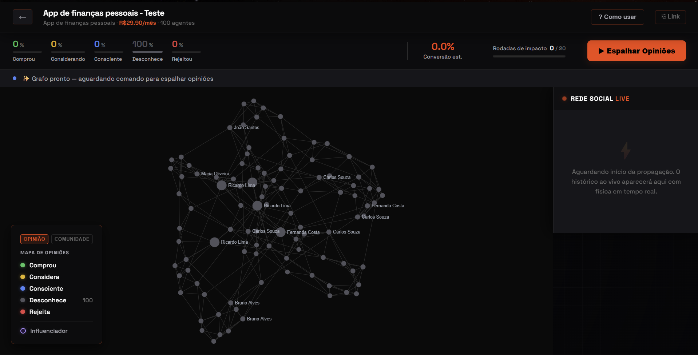</td>
</tr>
<tr>
<td>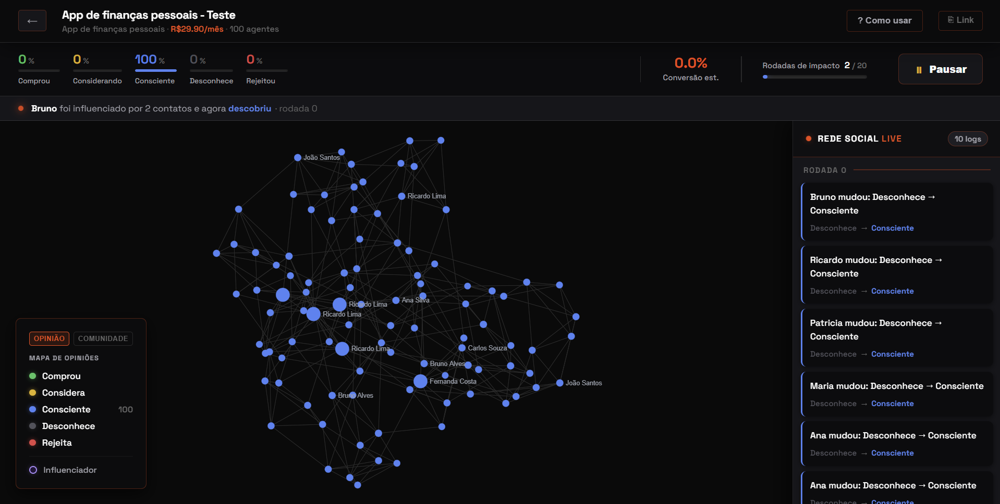</td>
<td>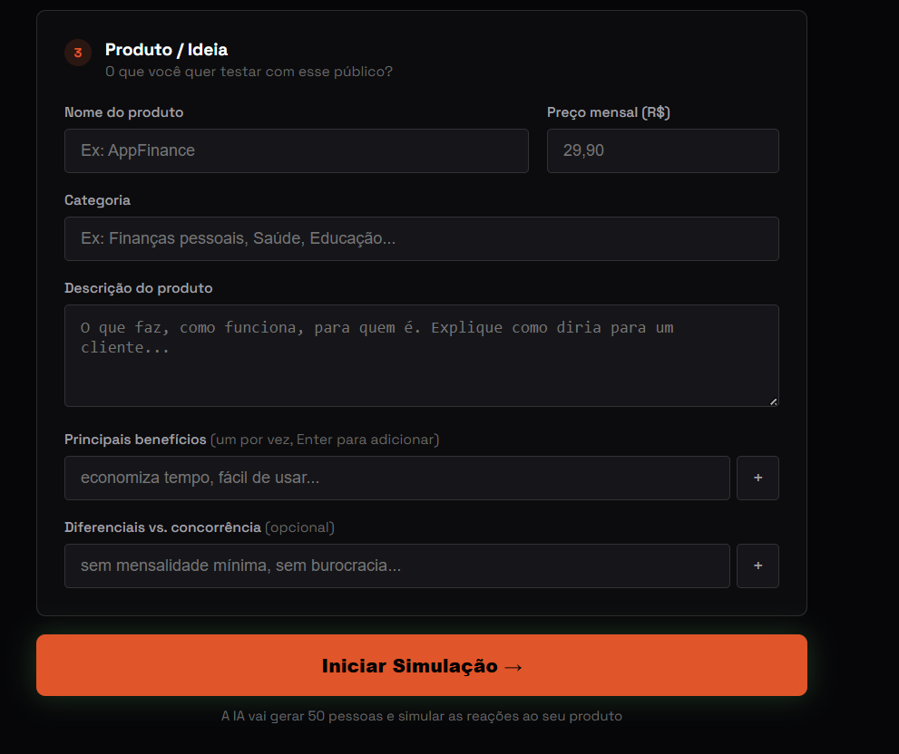</td>
</tr>
</table>
</div>

---

## Engine Architecture

1. **Graph + Persona Generation** — LLM generates 50–500 unique psychological profiles via parallel async calls with `@async_retry` (exponential backoff + jitter). Profiles include age, income class, interests, risk tolerance, price sensitivity.
2. **Funnel Setup** — Agents allocated across `Unaware → Aware → Considering → Adopted / Rejected`.
3. **Tick Engine** — Each tick applies weighted influence through connected nodes. Influence is scaled by `_homophily_weight(a,b) → [0.5, 1.0]` (demographic similarity) and modulated by Risk Tolerance vs. Price Sensitivity. Agent confidence decays 2% per tick, making priors progressively easier to override.
4. **2-Pass Report** — Pass 1: LLM generates draft analysis. Pass 2: LLM receives its own draft alongside real simulation metrics and performs self-critique, correcting internal inconsistencies before the final output is delivered.

---

## v3.0 — Architectural Improvements

| Feature | Technical Detail |
|---------|-----------------|
| **Social Homophily** | `_homophily_weight(a,b) → [0.5, 1.0]` — same age bracket (+0.3), same income class (+0.3), shared interests (up to +0.4) |
| **Temporal Decay** | `confidence *= (1 - DECAY_RATE * tick)` — prior resistance erodes under sustained social pressure |
| **Confidence Interval** | 95% CI via numpy: `opinion_ci_low`, `opinion_ci_high` displayed in the metrics bar |
| **2-Pass Report** | Draft → self-critique → final output consistent with actual data |
| **Smart Retry** | `@async_retry` with exponential backoff + jitter — resilient to Groq rate limits |
| **Structured Logging** | `RotatingFileHandler` 10 MB + JSONL audit trail per simulation in `data/logs/` |
| **API Envelope** | All routes return `{"success": bool, "data": T, "error": str}` — zero ambiguity |
| **Atomic Storage** | Writes via `.tmp → rename` — no corrupt JSONs on crashes |
| **Quarantine** | Corrupt files moved to `data/corrupt/` on startup automatically |
| **Random Seed** | `random_seed` exposed — same parameters + same seed = identical result |
| **WS Auto-Reconnect** | Automatic reconnection with exponential backoff (1s → 30s, 6 retries) |
| **Error Boundary** | React `ErrorBoundary` on every page — isolated crashes without losing state |

---

## Simulation Analytics

### Live Opinion Propagation — Animated

<div align="center">
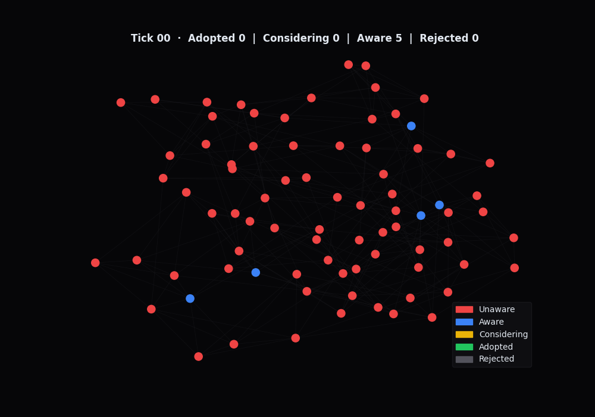
<br/><i>Watts-Strogatz network · nodes transition Unaware → Aware → Considering → Adopted/Rejected across 20 ticks</i>
</div>

---

### Static Analysis Charts

<div align="center">
<table>
<tr>
<td width="50%">
  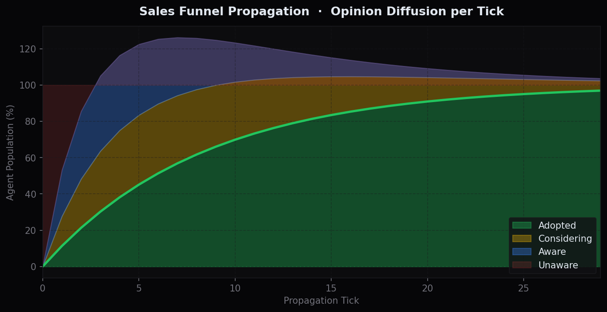
  <br/><i>Sales Funnel Propagation — population flow per tick</i>
</td>
<td width="50%">
  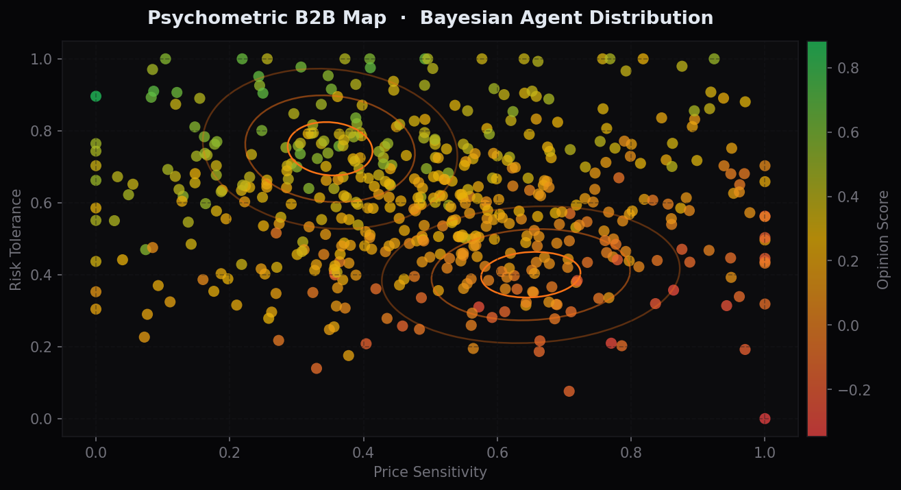
  <br/><i>Psychometric B2B Map — Price Sensitivity vs. Risk Tolerance</i>
</td>
</tr>
<tr>
<td>
  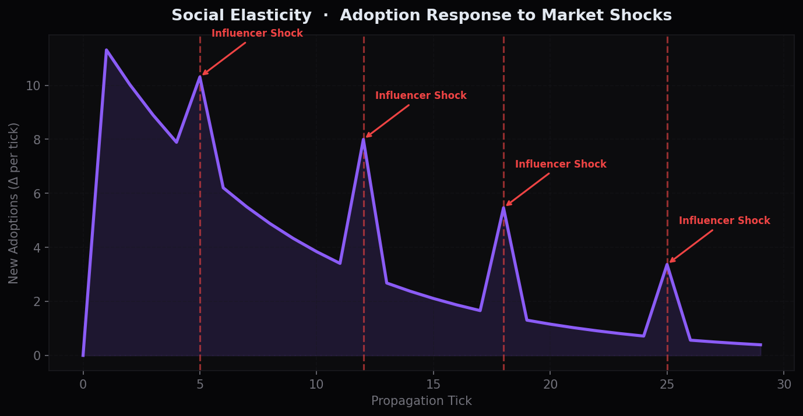
  <br/><i>Social Elasticity — adoption response to influencer shocks</i>
</td>
<td>
  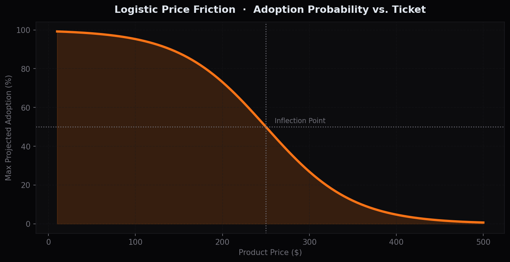
  <br/><i>Logistic Price Friction — adoption probability vs. ticket price</i>
</td>
</tr>
<tr>
<td>
  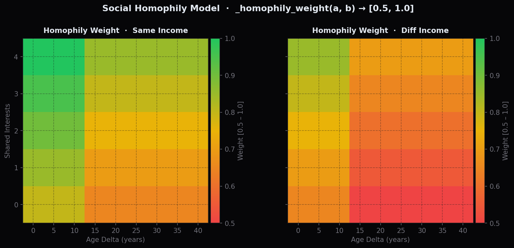
  <br/><i>Homophily Model — influence weight by demographic similarity</i>
</td>
<td>
  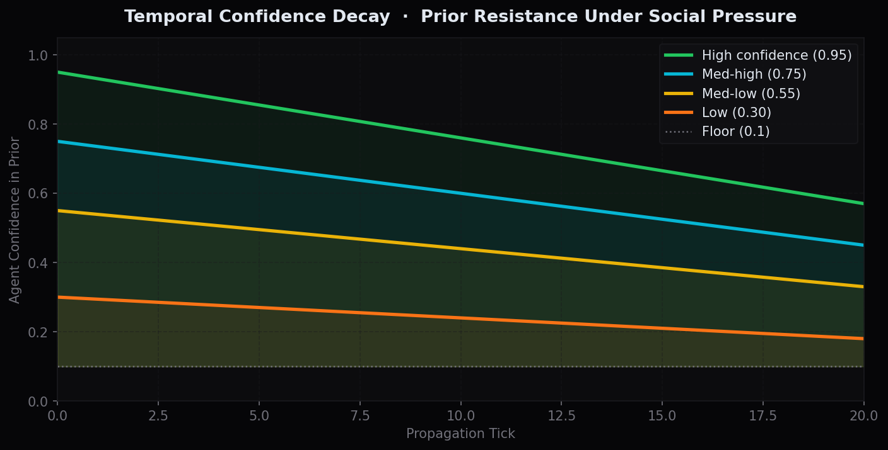
  <br/><i>Temporal Confidence Decay — prior erosion under social pressure</i>
</td>
</tr>
<tr>
<td colspan="2" align="center">
  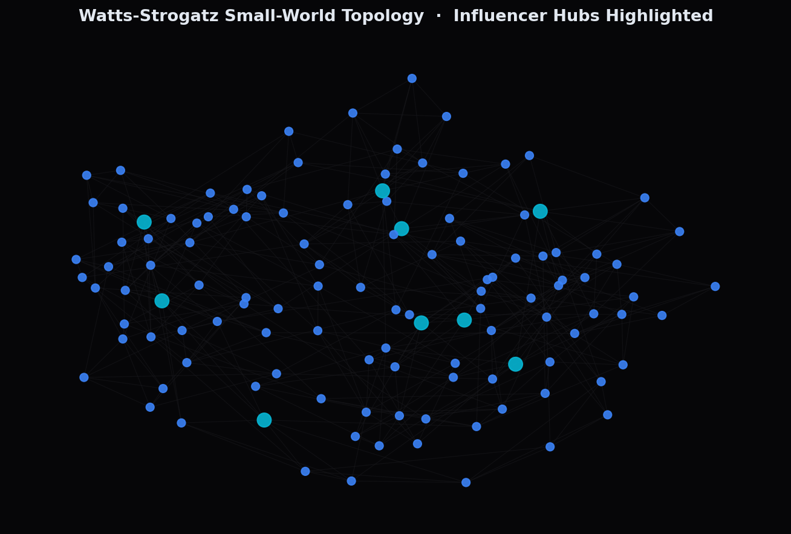
  <br/><i>Watts-Strogatz Small-World Topology — influencer hubs highlighted</i>
</td>
</tr>
</table>
</div>

---

## Quick Start

### 1. Configure Environment

In the `backend` directory, create `.env`:
```env
GROQ_API_KEY=your_key_here
GROQ_MODEL=llama-3.3-70b-versatile
```
Get a free key at [console.groq.com](https://console.groq.com).

### 2. Start the Backend
```bash
cd backend
python -m venv venv
.\venv\Scripts\activate
pip install -r requirements.txt
python -m uvicorn main:app --reload --reload-exclude "data/*" --host 0.0.0.0 --port 8000
```

### 3. Start the Frontend
```bash
cd frontend
npm install
npm run dev
```

Open `http://localhost:5173`.

---

## Roadmap

v3.0 consolidated the scientific base: homophily, temporal decay, confidence intervals, 2-pass report, atomic storage, structured logging, reproducible seeds, and WS auto-reconnect.

**v4.0 targets:**
- Multi-product simulation (A/B GTM comparison)
- PDF report export
- Side-by-side comparison between runs with the same seed

PRs optimizing `opinion_model.py` — especially `_homophily_weight` and decay parameters — are welcome.

<div align="center">
  <sub>Built to simulate and win markets before competitors take notice.</sub>
</div>
